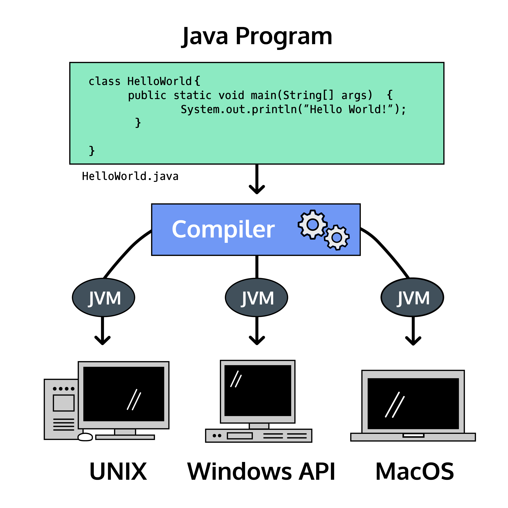
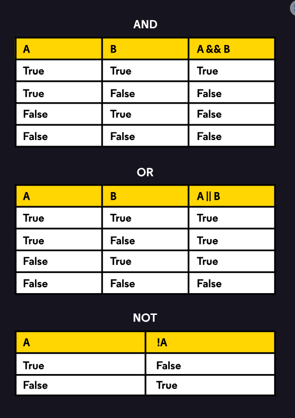

## Introduction to Java
Welcome to the world of Java programming!

Programming languages enable humans to write instructions that a computer can perform. With precise instructions, computers coordinate applications and systems that run the modern world.

Sun Microsystems released the Java programming language in 1995. Java is known for being simple, portable, secure, and robust. Though it was released over twenty years ago, Java remains one of the most popular programming languages today.

One reason people love Java is the Java Virtual Machine, which ensures the same Java code can be run on different operating systems and platforms. Sun Microsystems’ slogan for Java was “write once, run everywhere”.

Java Virtual Machine running Java on three different platforms

Programming languages are composed of syntax, the specific instructions which Java understands. We write syntax in files to create programs, which are executed by the computer to perform the desired task.

Let’s start with the universal greeting for a programming language. We’ll explore the syntax in the next exercise.

### public, static, and void are syntax we’ll learn about in future lessons.
String[] args is a placeholder for information we want to pass into our program. This syntax is necessary for the program to run but more advanced than we need to explore at the moment.

Our program also displayed the text "Hello World" on the screen. This was accomplished using a print statement:

System.out.println("Hello World");

We’ll learn more about print statements in the next exercise!

## Print Statements
Let’s take a closer look at this instruction from our previous program:

`System.out.println("Hello World");`

Print statements output information to the screen (also referred to as the output terminal). Let’s break this line of code down a little more. Don’t worry if some of the terms here are new to you. We’ll dive into what all of these are in much more detail later on!

* System is a built-in Java class that contains useful tools for our programs.
* out is short for “output”.
* println is short for “print line”.
  We can use System.out.println() whenever we want the program to create a new line on the screen after outputting a value:

`public class HideAndSeek {
public static void main(String[] args) {
System.out.println("Let's play hide and seek.");
System.out.print("Three...");
System.out.print("Two...");
System.out.println("One...");
System.out.println("Ready or not, here I come!");
}
}`

#### The following class shows what a comment would look like in a program.

`public class CommentExample {
// I'm a comment inside the class
public static void main(String[] args) {
// I'm a comment inside a method
System.out.println("This program has comments!");
}
}`

Comments are different from printing to the screen, when we use System.out.println(). These comments won’t show up in our terminal, they’re only for people who read our code in the text editor.

### Compilation: Catching Errors
Java is a compiled programming language, meaning the code we write in a .java file is transformed into byte code by a compiler before it is executed by the Java Virtual Machine on your computer.

A compiler is a program that translates human-friendly programming languages into other programming languages that computers can execute.

Steps of Java Compilation
Previous exercises have automatically compiled and run the files for you. Off-platform development environments can also compile and run files for you, but it’s important to understand this aspect of Java development so we’ll do it ourselves.

The compiling process catches mistakes before the computer runs our code.

The Java compiler runs a series of checks while it transforms the code. Code that does not pass these checks will not be compiled.

This exercise will use an interactive terminal. Codecademy has a lesson on the command line if you’d like to learn more.

For example, with a file called Plankton.java, we could compile it with the terminal command:

javac Plankton.java

A successful compilation produces a .class file: Plankton.class, that we execute with the terminal command:

java Plankton

An unsuccessful compilation produces a list of errors. No .class file is made until the errors are corrected and the compile command is run again.

`javac Compiling.java`

## Review
In this lesson, we’ve started writing our first programs in Java.

We’ve also learned rules and guidelines for how to write Java programs:

* Java programs have at least one class and one main() method.
* Each class represents one real-world idea.
* The main() method runs the tasks of the program.
* Java comments add helpful context to human readers.
* Java has whitespace, curly braces, and semicolons.
* Whitespace is for humans to read code easily.
* Curly braces mark the scope of a class and method.
* Semicolons mark the end of a statement.
* Java is a compiled language.
* Compiling catches mistakes in our code.
* Compilers transform code into an executable class.

## Learn Java: Manipulating Variables Review
What’s the use of having variables if you can’t do anything with them? We’ve now seen some ways you can operate on variables and compare them. The possibilities are endless!

We covered:

* Addition and subtraction, using + and -
* Multiplication and division, using * and /
* The modulo operator for finding remainders, %
* Compound assignment operators +=, -=, *=, /=, and %=.
* The order of operations: parentheses -> exponents -> multiplication, division, modulo -> addition, subtraction
* Greater than, >, and less than, <
* Equal to, ==, and not equal to, !=
* Greater than or equal to, >=, and less than or equal to, <=
* equals() for comparing Strings and other objects
* Using + to concatenate Strings
* The final keyword which makes variables unchangeable
Practice some of these concepts here, to make sure you have a solid foundation for learning more complicated and exciting Java concepts!

### Introduction to Classes
All programs require one or more classes that act as a model for the world.

For example, a program to track student test scores might have Student, Course, and Grade classes. Our real-world concerns, students and their grades, are inside the program as classes.

We represent each student as an instance, or object, of the Student class.

This is object-oriented programming because programs are built around objects and their interactions. An object contains state and behavior.

Classes are a blueprint for objects. Blueprints detail the general structure. For example, all students have an ID, all courses can enroll a student, etc.

An instance is the thing itself. This student has an ID of 42, this course enrolled that student, etc.

Let’s review with another example, a savings account at a bank.

What should a savings account know?

* The balance of money available.

What should a savings account do?

* Deposit money.
* Withdraw money.

Imagine two people have accounts that are instances of the SavingsAccount class. They share behavior (how they deposit and withdraw) but have individual state (their balances), and even with the same balance amount these accounts are separate entities.

how to create a price and set taxes on it 

## Review
Great work! Methods are a powerful way to abstract tasks away and make them repeatable. They allow us to define behavior for classes, so that the Objects we create can do the things we expect them to. Let’s review everything we have learned about methods so far.

* Defining a method : Method declarations will declare a method’s return type, name, and parameters
* Calling a method : Methods are invoked with a . and ()
* Parameters : Inputs to the method and their types are declared in parentheses in the method signature
* Changing Instance Fields : Methods can be used to change the value of an instance field
* Scope : Variables only exist within the domain that they are created in
* Return : The type of the variables that will be output are declared in the method declaration

As you move through more Java material, it will be helpful to frame the tasks you create in terms of methods. This will help you think about what inputs you might need and what output you expect.

    public class SavingsAccount {
    
    int balance;
    
    public SavingsAccount(int initialBalance){
    balance = initialBalance;
    }
    
    public void checkBalance(){
    System.out.println("Hello!");
    System.out.println("Your balance is "+balance);
    }
    
    public void deposit(int amountToDeposit){
    balance = amountToDeposit + balance;
    System.out.println("You just deposited " + amountToDeposit);
    }
    
    public int withdraw(int amountToWithdraw){
    balance = balance - amountToWithdraw;
    System.out.println("You just withdrew " + amountToWithdraw);
    return amountToWithdraw;
    }
    
    public String toString(){
    return "This is a savings account with " + balance + " saved.";
    }

    public static void main(String[] args){
    SavingsAccount savings = new SavingsAccount(2000);

    //Check balance:
    savings.checkBalance();
    
    //Withdrawing:
    savings.withdraw(300);
    
    //Check balance:
    savings.checkBalance();
    
    //Deposit:
    savings.deposit(600);
    
    //Check balance:
    savings.checkBalance();
    
    //Deposit:
    savings.deposit(600);
    
    //Check balance:
    savings.checkBalance();
    
    System.out.println(savings);
    }       
    }
    
conditionals

## Review
Before this lesson, our code executed from top to bottom, line by line.

Conditional statements add branching paths to our programs. We use conditionals to make decisions in the program so that different inputs will produce different results.

Conditionals have the general structure:

    if (condition) {
    // consequent path
    } else {
    // alternative path
    }

Specific conditional statements have the following behavior:

    if-then:
code block runs if condition is true

    if-then-else:
one block runs if conditions is true
another block runs if condition is false

    if-then-else chained:
same as if-then but an arbitrary number of conditions

    switch:
switch block runs if condition value matches case value

### Introduction to Conditional Operators

****
## Review Conditional Operators
Conditional operators work on boolean values to simplify our code. They’re often combined with conditional statements to consolidate the branching logic.

Conditional-AND, &&, evaluates to true if the booleans on both sides are true.

* Conditions placed in parentheses - ()
* NOT - !
* AND - &&
* OR - ||

    `if (true && false) {
    System.out.println("You won't see me print!");
    } else if (true && true) {
    System.out.println("You will see me print!");
    }`

Conditional-OR, ||, evaluates to true if one or both of the booleans on either side is true.

    `if (false || false) {
    System.out.println("You won't see me print!");
    } else if (false || true) {
    System.out.println("You will see me print!");
    }`

Logical-NOT, !, evaluates to the opposite boolean value to which it is applied.

    `if (!false) {
    System.out.println("You will see me print!");
    }`

### Arrays
    `int firstNumber = 4;
    int secondNumber = 8;
    int thirdNumber = 15;
    int fourthNumber = 16;
    int fifthNumber = 23;`

Notice that the indexes start at 0! The element at index 0 is 4, while the element at index 1 is 8. 
This array has a length of 5, since it holds five elements, but the highest index of the array is 4.

    String[] robotArticles = {"Oil News", "Innovative Motors", "Humans: Exterminate Or Not?", "Organic Eye Implants", "Path Finding in an Unknown World"};
    int[] robotViewers = {87, 32, 13, 11, 7};
    double[] robotRatings = {2.5, 3.2, 5.0, 1.7, 4.3};

### Review
We have now seen how to store a list of values in arrays. We can use this knowledge to make organized programs with more complex variables.

Throughout the lesson, we have learned about:

* Creating arrays explicitly, using 
`{ and }`

* Accessing an index of an array using `[ and ]`.

* Creating empty arrays of a certain size, and filling the indices one by one.
Getting the length of an array using length.

* Using the argument array args that is passed into the` main()` method of a class.

### Review of Arraylists
Nice work! You now know the basics of ArrayLists including:

* Creating an ArrayList.
* Adding a new ArrayList item using add().
* Accessing the size of an ArrayList using size().
* Finding an item by index using get().
* Changing the value of an ArrayList item using set().
* Removing an item with a specific value using remove().
* Retrieving the index of an item with a specific value using indexOf().

Now if only there were some way to move through an array or ArrayList, item by item…

### Review java loops

Nice work! Let’s iterate over what you’ve just learned about loops:

* while loops: These are useful to repeat a code block an unknown number of times until some condition is met. For example:
    

    int wishes = 0;
    
    while (wishes < 3) {
    
    // code that will run
    wishes++;
    
    }

* for loops: These are ideal for when you are incrementing or decrementing with a counter variable. For example:

    for (int i = 0; i < 5; i++) {
    
    // code that will run
    
    }

* For-each loops: These make it simple to do something with each item in a list. For example:

    for (String inventoryItem : inventoryItems) {
    
    // do something with each inventoryItem
    
    }

### Review

Congratulations! 🙌

We have learned some of the string methods that come with the String class:

* length()
* concat()
* indexOf()
* charAt()
* equals() / equalsIgnoreCase()
* substring()
* toUpperCase() / toLowerCase()

### Review ACCESS, ENCAPSULATION, AND SCOPE (hard)

Nice work! In this lesson, we dove into some of the more subtle features of classes with a focus on access, encapsulation, and scope. Here are some of the main takeaways from this lesson:

* The public and private keywords are used to define what parts of code have access to other classes, methods, constructors, and instance variables.

* Encapsulation is a technique used to keep implementation details hidden from other classes. Its aim is to create small bundles of logic.

* The `this` keyword can be used to designate the difference between instance variables and local variables.

* Local variables can only be used within the scope that they were defined in.

* The `this` keyword can be used to call methods when writing classes.

## Math
Our second option for calling a static method from the Math class is to import the class by adding import static java.lang.Math.*; 
to the top of our program. 
If we import the Math class, we can reference the method using only the method name like so:

    import static java.lang.Math.*; // import Math class

    class Numbers {
    public static void main(String[] args) {
    // Call method by using method name and arguments
    int smallerNumber = min(3, 10);
    System.out.println(smallerNumber); // Prints: 3
    }
    }

**int abs(int x)**
Purpose: Returns the absolute value of an int value

The absolute value states how many numbers a value is away from 0. The absolute value is always a positive number. For example, the absolute value of -5 is 5 because it is 5 away from 0. In Java, we can get the absolute value of a number like this:

    System.out.println(Math.abs(5)); // Prints: 5
    System.out.println(Math.abs(-5)); // Prints: 5

**double abs(double x)**
Purpose: Returns the absolute value of a double value

This is similar to the previous method, but this method takes in and returns a double type value:

    System.out.println(Math.abs(5.0)); // Prints: 5.0
    System.out.println(Math.abs(-5.0)); // Prints: 5.0

What will the following statement output?

    int x = Math.abs(-15) + 5;
    System.out.println(x)
  
    
    (Selected)Correct:
    20

**double pow(double base, double exponent)**
Purpose: Returns the value of the first parameter raised to the power of the second parameter.

The power, or exponent, describes how many times a number should be multiplied by itself. For example, 5 to the power of 3 is equivalent to 5 * 5 * 5, or 125. If we wanted to see this in Java, we could use Math.pow() like this:

    double x = Math.pow(5, 3);
    System.out.println(x); // Prints: 125.0

**double sqrt(double x)**
Purpose: Returns the positive square root of a double value

The square root of a number represents what value can be multiplied by itself in order to equal a specified value. For example, the square root of 49 is 7 because 7 * 7 is 49. In java, getting the square root of a value looks like this:

    double x = Math.sqrt(49);
    System.out.println(x); // Prints: 7.0
    double y = Math.sqrt(52);
    System.out.println(y); // Prints: 7.211102550927978

Fill in the blank to create a program that outputs 9.0:

    double area = 81.0;
    double side = Math.sqrt(area);
    System.out.println(side); // Prints 9.0

**double random()**
Purpose: Returns a double value greater than or equal to 0.0 and less than 1.0

Randomization is a great way to add probability to our programs. There are many ways to implement Math.random() in Java. Its default use case is to produce a random double value between 0.0 and 1.0. For example:

    System.out.println(Math.random());
    System.out.println(Math.random());
    System.out.println(Math.random());

The random values can change every time we run our program. An example output of the above program is the following:

    0.8592007008856128
    0.6120058754881421
    0.48259656765819403

With some manipulation, we can use Math.random() to create a random int or double value within a predefined range.

For example, if we wanted a random double value between 0 and 10, not including 10, we would multiply Math.random() by 10

    // Random double value between 0 and 10, not including 10
    double a = Math.random() * 10;

If we wanted a random int value between 0 and 9, we would need to implement the (int) casting operator in our expression like so:

    // Random int value between 0 and 9
    int b = (int)(Math.random() * 10);

If we wanted our range to start at 1 and end at 10, we would have to add 1 to the end of our previous expression:

    // Random int value between 1 and 10
    int c = (int)(Math.random() * 10) + 1;

Using addition also gives us the ability to start the range at any number. What if we wanted an int value in the range of 10 up to and including 20? We would have to implement the algorithm (Math.random() * (maxValue - minValue + 1)) + minValue.

For example:

    // Random int value between 10 and 20
    int d = (int)(Math.random() * 11 ) + 10;

We multiply Math.random() by 11 because 20 (our max value) minus 10 (our minimum value) plus 1 is 11. We add + 10 outside the parentheses so that our smallest value is guaranteed to be 10.

### Review STATIC VARIABLES AND METHODS

Great work! You now have an understanding of what the static keyword does. In fact, if you’ve made it this far in your Java lessons, you probably have a pretty good sense of what all the keywords and jargon are doing in public static void main(String[] args). Take a moment to celebrate — that line of code can be incredibly intimidating for new learners and it’s a real accomplishment to learn about all of those different pieces.

To review, here are some of the main takeaways about static methods and variables:

* Static methods and variables are associated with the class as a whole, not objects of the class.
* Static methods and variables are declared as static by using the static keyword upon declaration.
* Static methods cannot interact with non-static instance variables. This is due to static methods not having a this reference.
* Both static methods and non-static methods can interact with static variables.

